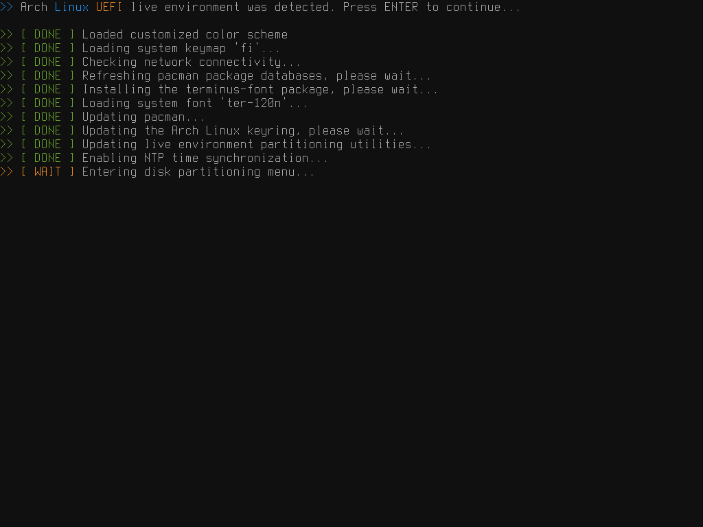
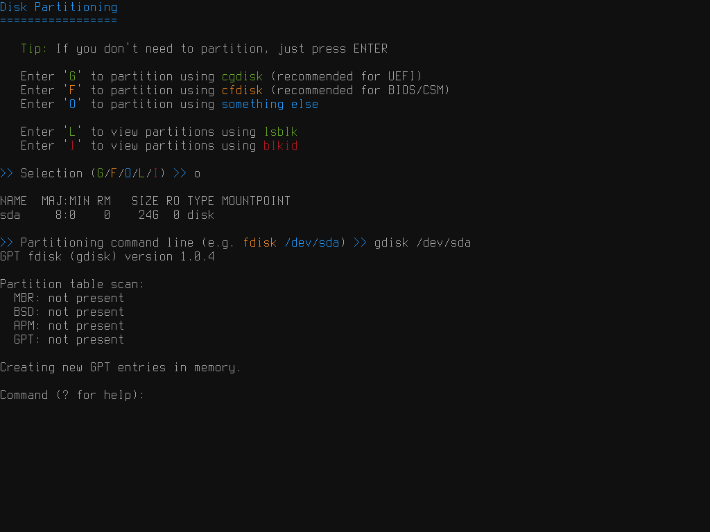
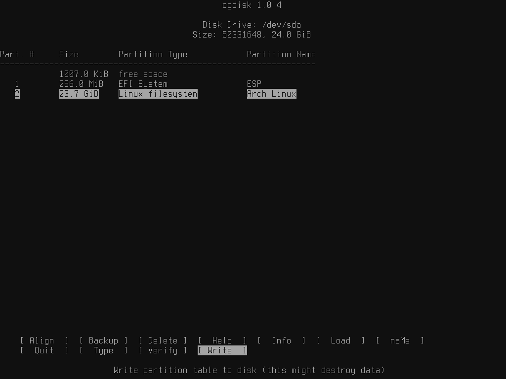
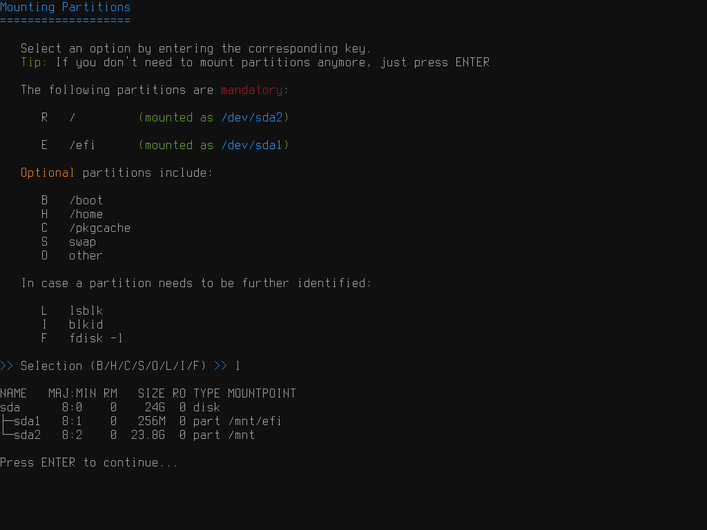
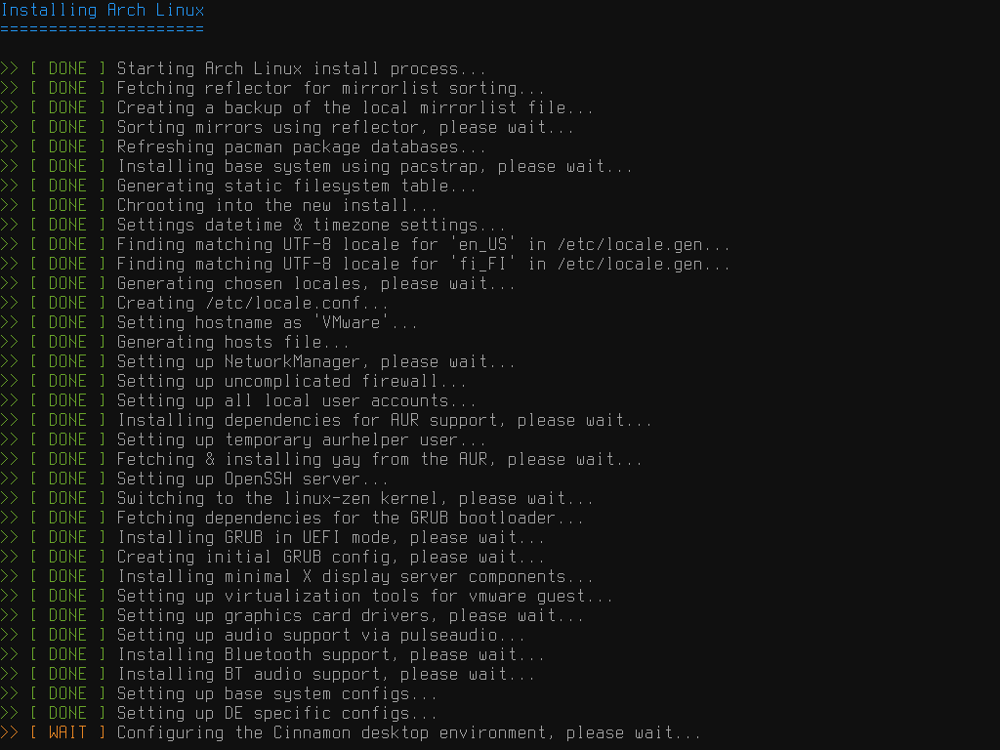
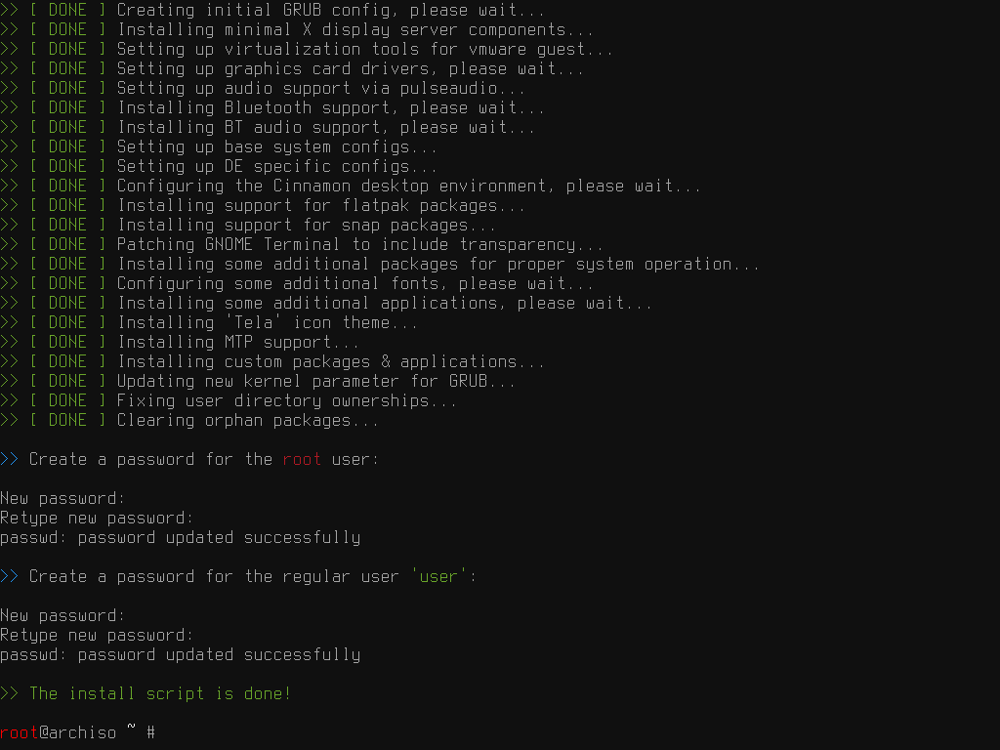
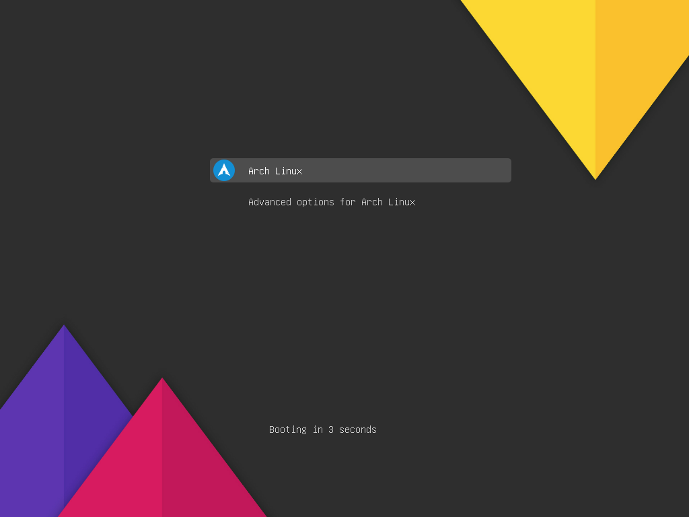
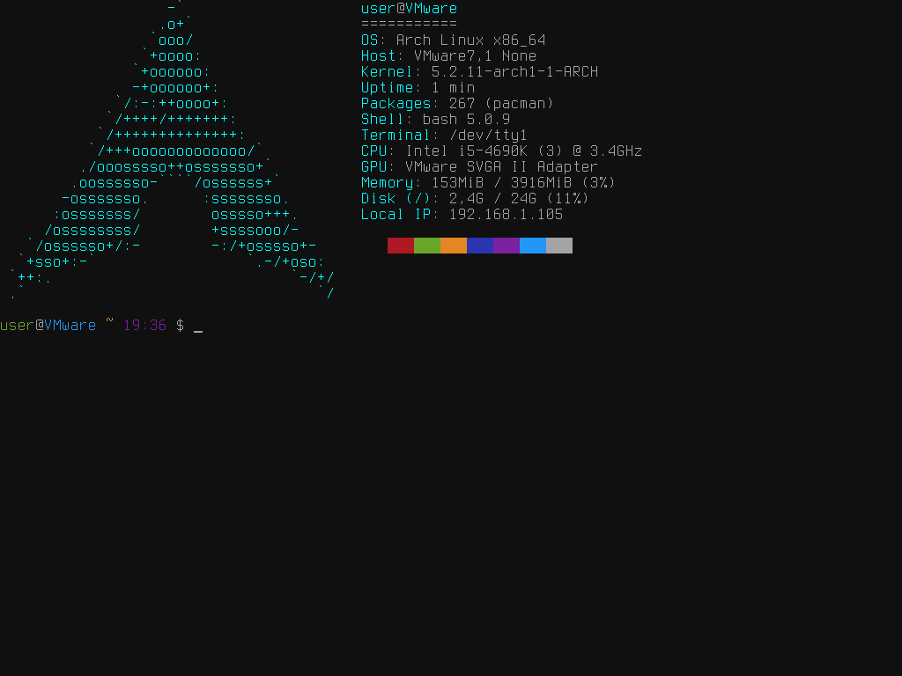
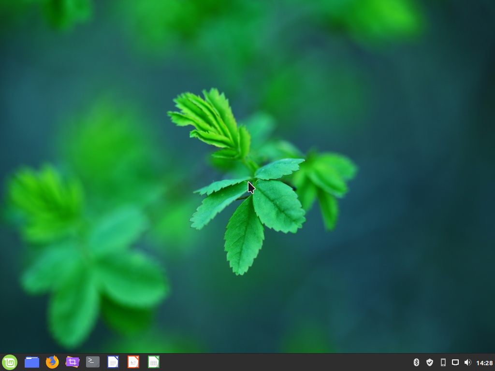

# ArchInstaller.py
A semi-automatic & configurable Arch Linux installer script written in Python.

Actual script configuration is done in the [`config.py`](config.py) module & [`custom_setup()`](setup.py#L24) method found at the top of [`setup.py`](setup.py).

You should already be familiar with [Arch Linux](https://www.archlinux.org) before using this and be prepared to fix stuff yourself as things may and inevitably **will** go wrong.

**DISCLAIMER:** This is still `alpha` state software and will keep changing in the future.

### Table of Contents
* [Deployment](#deployment)
* [Lists in config](#lists-in-config)
* [Following progress](#following-progress)
* [Screenshots](#screenshots)
* [Resources](#resources)

## Deployment
The following examples expect you to already be booted into the ArchISO environment.

To fetch and run the script, one can execute:
```bash
curl https://git.io/JemEQ -Lo setup.py
python setup.py
# Fetch a copy of config.py as suggested by the script and edit it to suit your needs!
# Afterwards launch the script again and follow the instructions
python setup.py
```

For remote deployment of the scripts to a system (e.g. Virtual Machine) via ethernet I've been using the following:
```
TARGET #

passwd                –  required to use SSH
systemctl start sshd  –  launching the SSH server Daemon
ip a                  –  get live system IP for SSH / file transfer (e.g. 192.168.1.105)
```
Then to transfer the scripts via terminal from the current directory to the target system:
```
HOST $ scp *.py root@192.168.1.105:/root/
root@192.168.1.105's password:
config.py                                                         100% 6246     2.3MB/s   00:00
setup.py                                                          100%  111KB  73.3MB/s   00:00
```
Using the script is as simple as running it like any other (Python) executable:
```
TARGET # ./setup.py
```
The rest should be self-explanatory when following the instructions during install :)

## Lists in config
The [`config.py`](config.py) file has some options with long lists of available values; they're all catalogued here for your convenience:

* [Keymaps](Lists/vconsole-keymaps.txt)
* [Timezones](Lists/timezones.txt)
* [Locales](Lists/locales.txt)
* [TTY fonts](Lists/vconsole-fonts.txt)

## Following progress
To follow the progress and view the commands being run by the script, switch to another TTY / login via SSH and do:
```
TARGET # tail -f /tmp/setup.log
```
**NOTE:** This will need to be ended with `Ctrl` + `C` when entering chroot as the file gets moved, then run this command again.

Once the system is installed the log will be moved to `/var/log/setup.log` on the target system for further investigation / removal.

## Screenshots
### Script initialization


### Disk partitioning



### Mounting partitions


### Installation



### GRUB boot menu (shown when multibooting)


### Desktop Environments (DEs)

#### Base system install


#### Cinnamon


#### XFCE, GNOME, MATE, Budgie, Pantheon, Deepin, KDE (Plasma), LXQt, LXDE, Openbox, i3
Coming soon™️

## Resources
* [Arch Linux wiki](https://wiki.archlinux.org)
* [D3SOX's Arch guide](https://arch.d3sox.icu)
